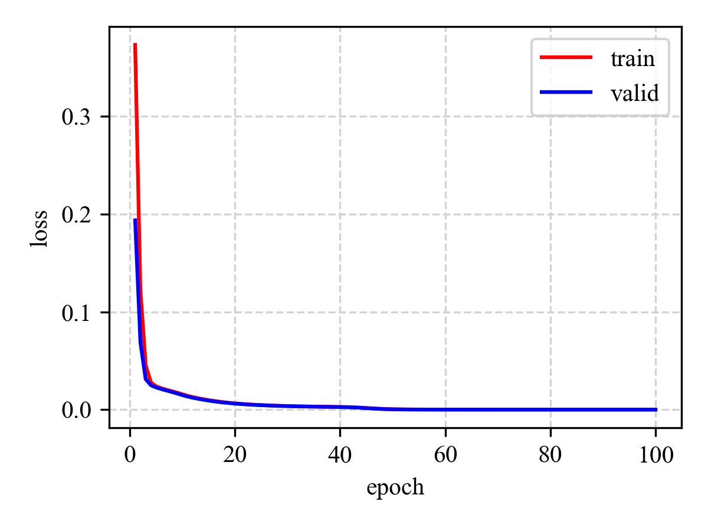
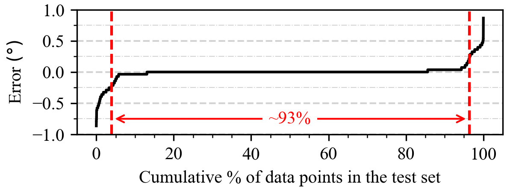

# Phase Shift Prediction

[]()

This repository is the official implementation of [Ripple Minimization in Asymmetric Interleaved
DC-DC Converters Using Neural Networks](). 

This study designs a neural network (NN) model predicting phase-shift angle to minimize the total current ripple of the common output capacitor of a multiphase DC-DC converter system. Phase-shift angle prediction is formulated as a regression problem using the system’s operating conditions. 


Folder structure:

```console
Phase Shift Prediction
├── _images
├── data
├── phase_shift_prediction
├── README.md
└── requirements.txt
```

We will explain the following steps one-by-one:

* [Required Python Packages](#required-python-packages)
* [Machine Learning Dataset](#machine-learning-dataset)
* [Phase Shift Prediction](#phase-shift-prediction)


## Required Python Packages

All the experiments were run in a virtual environment created with pip.

To install requirements:

```console
pip install -r requirements.txt
```

## Machine Learning Dataset

Let $\mathcal{D}$ be a machine learning dataset such that for each $(OC,\theta_{opt}) \in \mathcal{D}$, $OC=(V_{in1},~I_{in1},~V_{in2},~I_{in2})$ is an operating condition of the converter system and $\theta_{opt} \in [0\degree, 360\degree]$ is the corresponding optimal phase-shift angle to minimize the total current ripple of the common output capacitor. The input voltages and currents are $V_{in1}, V_{in2} \in \\{15.0V, 16.0V, \cdots, 50.0V\\}$ and $I_{in1}, I_{in2} \in \\{0.6A, 0.8A, \cdots, 2.0A\\}$, respectively. Hence, there are 219024 data points in the machine learning dataset, i.e., $|\mathcal{D}|=219024$. Then, the dataset is randomly segregated into three disjoint sets: training, validation, and test, with 146016, 24336, and 48672 data points, respectively. Please note that min-max normalization is applied on the raw data before feeding to the network.

The "data" folder stores the machine learning dataset. 

```console
data
├── data_train_normalized.txt
├── data_train_raw.txt
├── data_valid_normalized.txt
├── data_valid_raw.txt
├── data_test_normalized.txt
└── data_test_raw.txt
```

A few example data points from the test set are shown below.

> `data_test_raw.txt`

| $V_{in1}$ | $I_{in1}$ | $V_{in2}$ | $I_{in2}$ | $\theta_{opt}$|
| --- | --- | --- | --- | --- |
| 15.00 | 0.60 | 15.00 | 0.60 | 90.00 |
| 15.00 | 0.60 | 15.00 | 0.80 | 90.00 |
| 15.00 | 0.60 | 15.00 | 1.00 | 90.00 |
| 15.00 | 0.60 | 16.00 | 2.80 | 96.00 |

> `data_test_normalized.txt`

| $V_{in1}$ | $I_{in1}$ | $V_{in2}$ | $I_{in2}$ | $\theta_{opt}$|
| --- | --- | --- | --- | --- |
| 0.0000 | 0.0000 | 0.0000 | 0.0000 | 0.2500 |
| 0.0000 | 0.0000 | 0.0000 | 0.0833 | 0.2500 |
| 0.0000 | 0.0000 | 0.0000 | 0.1667 | 0.2500 |
| 0.0000 | 0.0000 | 0.0286 | 0.9167 | 0.2667 |

## Phase Shift Prediction

The model can be represented as a function parameterized by $\mathcal{W}$ (weights and biases in the network), $f_\mathcal{W}$. The model takes an operating condition $OC = (V_{in1},I_{in1},V_{in2},I_{in2})$ as input, where $V_{in1},V_{in2} \in [15.0V,50.0V]$ and $I_{in1},I_{in2} \in [0.6A,3.0A]$. Then, it predicts the corresponding phase-shift angle $\theta_{pred}=f_{\mathcal{W}}(OC) \in [0\degree,360\degree]$ at the output.


Initial content of the folder:

```console
phase_shift_prediction
├── dataset.py
├── model.py
├── train.py
├── plot_loss.py
├── test.py
├── obtain_performance_metrics.py
├── saved_models
├── loss_data
└── test_metrics
```

To train the model:

```console
python train.py
```

The model weights were saved into the "saved_models" folder.

```console
saved_models
├── state_dict__2023_04_27__00_19_15__best_4872.pth
...
```

The loss values calculated on the training and validation sets were stored into the "loss_data" folder.

```console
loss_data
├── step_loss_metrics__2023_04_27__00_19_15.txt
...
```

To plot loss curves over the epochs:

```console
python plot_loss.py loss_data/step_loss_metrics__2023_04_27__00_19_15.txt
```




To check the performance of the trained model on the test set:

```console
python test.py --init_model_file saved_models/state_dict__2023_04_27__00_19_15__best_4872.pth
```

The predictions were stored under the corresponding folder inside the "test_metrics" folder.

```console
test_metrics
└── 2023_04_27__00_19_15__best_4872
    └── data_test_normalized
        └── predictions_2023_04_27__00_19_15__best_4872.txt
```

> `predictions_2023_04_27__00_19_15__best_4872.txt`

| $V_{in1}$ | $I_{in1}$ | $V_{in2}$ | $I_{in2}$ | $\theta_{opt}$ | $\theta_{pred}$ |
| --- | --- | --- | --- | --- | -- |
| 0.0000 | 0.0000 | 0.0000 | 0.0000 | 0.2500 | 0.2500
| 0.0000 | 0.0000 | 0.0000 | 0.0833 | 0.2500 | 0.2500
| 0.0000 | 0.0000 | 0.0000 | 0.1667 | 0.2500 | 0.2500
| 0.0000 | 0.0000 | 0.0286 | 0.9167 | 0.2667 | 0.2667


Predictions were then processed to obtain performance metrics:

```console
python obtain_performance_metrics.py --data_file test_metrics/2023_04_27__00_19_15__best_4872/data_test_normalized/predictions_2023_04_27__00_19_15__best_4872.txt
```

Residual error vs. cumulative % data points was plotted and performance statistics were saved inside the same folder.

```console
test_metrics
└── 2023_04_27__00_19_15__best_4872
    └── data_test_normalized
        ├── predictions_2023_04_27__00_19_15__best_4872.txt
        ├── residual_errors__2023_04_27__00_19_15__best_4872.pdf
        ├── residual_errors__2023_04_27__00_19_15__best_4872.png
        └── statistics__2023_04_27__00_19_15__best_4872.txt
```

> `statistics__2023_04_27__00_19_15__best_4872.txt`

```console
root_mean_square_error = 0.1093 (95% CI:0.1075 - 0.1111)
mean_absolute_error = 0.0386 (95% CI:0.0377 - 0.0395)
```


> `residual_errors__2023_04_27__00_19_15__best_4872.png`




